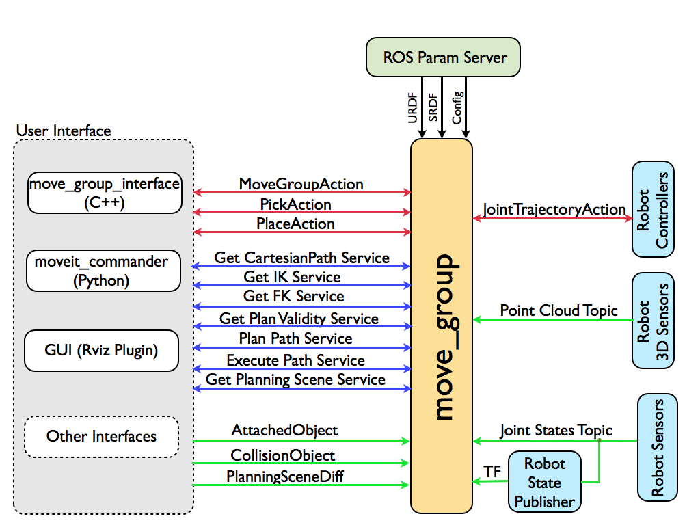

Moveit!的介绍和简单使用
^^^^^^^^^^^^^^^^^^^^^^^^^^

1.Moveit! 运动规划框架介绍
-------------------------------

在实现机械臂的自主抓取中机械臂的运动规划是其中最重要的一部分，其中包含运动学正逆解算、碰撞检测、环境感知和动作规划等。Gauss机械臂的运动规划采用的是ROS系统提供的MoveIt! 规划。

MoveIt! 是ROS系统中集合了与移动操作相关的组件包的运动规划库。它包含了运动规划中所需要的大部分功能，同时其提供友好的配置和调试界面便于完成机器人在ROS系统上的初始化及调试，其具体架构如下图所示：

（1）move_group: move_group是MoveIt!的核心部分，它的功能在于集成机器人的各独立模块并为用户提供一系列的动作指令和服务。其本身并不具备太多的功能，起到的是积分器的作用，完成各功能包和插件的集成。

（2）场景规划（Planning Scene）: 通过场景规划，用户可以创建一个具体的工作环境或者加入障碍物。

（3）运动规划（motion panning): 在MoveIt!中，运动规划器起的作用是实现运动规划算法，其以插件的方式通过ROS的pluginlib接口完成信息的通讯，根据需求可制作或选用不同的规划算法。

（4）运动学（Kinematics）： 运动学算法是机械臂控制算法中的核心内容，其中包括正运动学算法和逆运动学算法，在MoveIt!中，运动学算法同样以插件的形式完成于ROS的集成，因此可根据实际需求，编写自己的运动学算法来控制机器人。

（5）碰撞检测（collision checking）： 为避免机器人自身或者和环境发生干涉导致意外的发生，在进行运动规划时碰撞检测是必不可少的一部分，在MoveIt!中，采用FCL（Flexible Collision Library）进行对象碰撞的运算。

（6）开源运动规划库（open motion planning library）: OMPL是一个的开源的C++库，主要用于运动规划，其中包含了大量用于运动规划的先进算法。该库中的算法以采样规划算法为主，通过其可以实现不同目标点之间的路径规划。

2.Moveit! 助手
-------------------------------

::

    roslaunch moveit_setup_assistant setup_assistant.launch

3.Moveit! 的基本接口及使用
-------------------------------

Moveit的接口在 move_group_。

.. _move_group:
    https://github.com/ros-planning/moveit/blob/master/moveit_commander/src/moveit_commander/move_group.py

MoveGroupCommander 类常用的api列表如下：

- get_current_joint_values
- set_joint_value_target
- get_current_pose
- set_pose_target
- plan
- compute_cartesian_path
- go
- set_max_velocity_scaling_factor
- set_max_acceleration_scaling_factor
- execute
- set_path_constraints

::

    #!/usr/bin/env python
    import sys
    import copy
    import rospy
    import moveit_commander
    import moveit_msgs.msg
    import geometry_msgs.msg

    print "============ Starting tutorial setup"
    moveit_commander.roscpp_initialize(sys.argv)
    rospy.init_node('move_group_python_interface_tutorial',
                            anonymous=True)

    robot = moveit_commander.RobotCommander()
    group = moveit_commander.MoveGroupCommander("gauss_arm")
    print "============ planning frame Reference frame: %s" % group.get_planning_frame()
    print "============ end effector Reference frame: %s" % group.get_end_effector_link()

    print "============ Printing robot state"
    print robot.get_current_state()

    group_variable_values = group.get_current_joint_values()
    print "============ Joint values: ", group_variable_values

    group_variable_values[0] = 1.0
    group.set_joint_value_target(group_variable_values)

    plan = group.plan()
    rospy.sleep(5)
    group.go(wait=True)

    print "move complete"

参考：

1. https://moveit.ros.org/documentation/planners/
2. http://moveit.ros.org/documentation/
3. http://moveit.ros.org/documentation/concepts/
4. https://blog.csdn.net/kalenee/article/details/80818658
5. http://ompl.kavrakilab.org/planners.html
6. https://www.ncnynl.com/archives/201610/1030.html
7. https://blog.csdn.net/wxflamy/article/details/79171337
8. https://blog.csdn.net/wxflamy/article/details/79160781
9. https://github.com/ros-planning/moveit
10. http://docs.ros.org/kinetic/api/moveit_tutorials/html/
11. http://docs.ros.org/kinetic/api/moveit_commander/html/index.html

