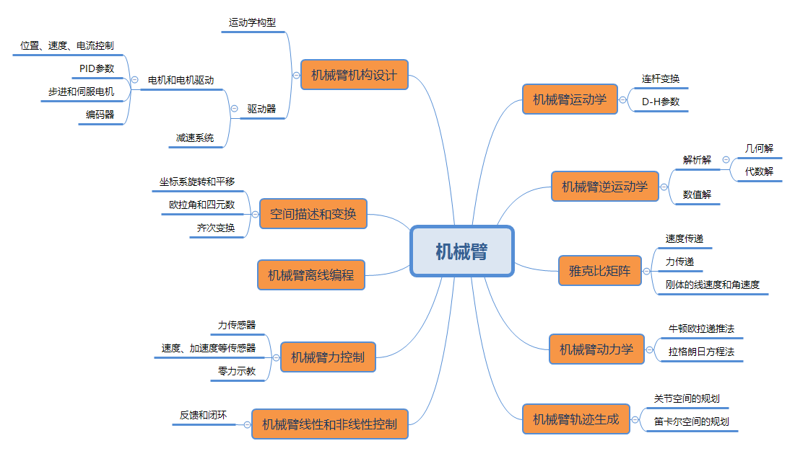

0.工业机器人的使用场景和基本原理
^^^^^^^^^^^^^^^^^^^^^^^^^^^^^^^^^^^^^^^^^

0.1 工业机器人的使用场景
-------------------------

工业机器依据具体应用的不同， 通常可以分成焊接机器人、 装配机器人、 喷漆机器人、码垛机器人、 搬运机器人等多种类型。 

- 焊接机器人， 包括点焊（ 电阻焊） 和电弧焊机器人，用途是实现自动的焊接作业。

- 装配机器人， 比较多地用于电子部件电器的装配。 

- 喷漆机器人，代替人进行喷漆作业。

- 码垛、 上下料、 搬运机器人的功能则是根据一定的速度和精度要求，将物品从一处运到另一处。

在工业生产中应用机器人，可以方便迅速地改变作业内容或方式，以满足生产要求的变化。 比如， 改变焊缝轨迹， 改变喷漆位置， 变更装配部件或位置等等。随着对工业生产线柔性的要求越来越高， 对各种机器人的需求也就越来越强烈。

0.2 机器人的基本组成和原理
---------------------------

机器人是典型的机电一体化产品， 一般由机械本体、 控制系统、 传感器、 和驱动器等四部分组成。 机械本体是机器人实施作业的执行机构。为对本体进行精确控制，传感器应提供机器人本体或其所处环境的信息，控制系统依据控制程序产生指令信号， 通过控制各关节运动坐标的驱动器， 使各臂杆端点按照要求的轨迹、 速度和加速度， 以一定的姿态达到空间指
定的位置。驱动器将控制系统输出的信号变换成大功率的信号， 以驱动执行器工作。

1．机械本体

机械本体， 是机器人赖以完成作业任务的执行机构， 一般是一台机械手， 也称操作器、或操作手， 可以在确定的环境中执行控制系统指定的操作。 典型工业机器人的机械本体一般由手部（ 末端执行器） 、 腕部、 臂部、 腰部和基座构成。 机械手多采用关节式机械结构， 一般具有6个自由度， 其中3个用来确定末端执行器的位置， 另外3个则用来确定末端执行装置
的方向（ 姿势） 。 机械臂上的末端执行装置可以根据操作需要换成焊枪、 吸盘、 扳手等作业工具。

2．控制系统

控制系统是机器人的指挥中枢， 相当于人的大脑功能， 负责对作业指令信息、 内外环境信息进行处理， 并依据预定的本体模型、 环境模型和控制程序做出决策， 产生相应的控制信号， 通过驱动器驱动执行机构的各个关节按所需的顺序、 沿确定的位置或轨迹运动， 完成特定的作业。 从控制系统的构成看， 有开环控制系统和闭环控制系统之分； 从控制方式看有程
序控制系统、 适应性控制系统和智能控制系统之分。

3．驱动器

驱动器是机器人的动力系统， 相当于人的心血管系统， 一般由驱动装置和传动机构两部分组成。 因驱动方式的不同， 驱动装置可以分成电动、 液动和气动三种类型。 驱动装置中的电动机、 液压缸、 气缸可以与操作机直接相连， 也可以通过传动机构与执行机构相连。 传动机构通常有齿轮传动、 链传动、 谐波齿轮传动、 螺旋传动、 带传动等几种类型。

4．传感器

传感器是机器人的感测系统， 相当于人的感觉器官， 是机器人系统的重要组成部分， 包括内部传感器和外部传感器两大类。 内部传感器主要用来检测机器人本身的状态， 为机器人的运动控制提供必要的本体状态信息， 如位置传感器、 速度传感器等。 外部传感器则用来感知机器人所处的工作环境或工作状况信息，又可分成环境传感器和末端执行器传感器两种类型； 前者用于识别物体和检测物体与机器人的距离等信息， 后者安装在末端执行器上， 检测
处理精巧作业的感觉信息。 常见的外部传感器有力觉传感器、 触觉传感器、 接近觉传感器、视觉传感器等。

0.3 机械臂基本原理思维导图
---------------------------

参考：

1. https://github.com/ros-industrial
2. http://wiki.ros.org/Robots/
3. https://industrial-training-master.readthedocs.io/en/melodic/
4. https://robots.ros.org/

