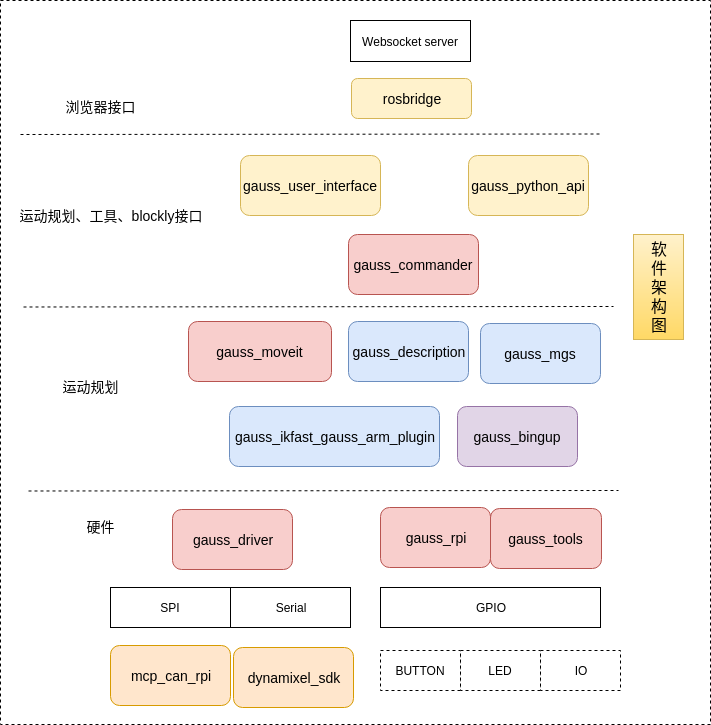

2. 高斯机械臂的软件架构
^^^^^^^^^^^^^^^^^^^^^^^^^^

2.1.软件架构
------------

上图为高斯机械臂的软件架构图。

1、圆角矩形为 ROS Package （ROS软件包），gauss_commander、gauss_moveit、gauss_driver、gauss_rpi、gauss_tools为核心包。

gauss_python_api 提供Python api，gauss_user_interface提供blockly功能和手柄功能，gauss_userinterface的功能实现基本是调用了gauss_python_api实现的。

2、白色矩形为各个ROS包实现的功能，如gauss_driver 通过mcp_can_api和dynamixelsdk实现了SPI通信和串口通信。gaussrpi和gauss_tools通过GPIO实现了按钮、LED、工具控制等功能。

3、蓝色矩形为其他功能包，gauss_ikfast_gauss_arm_plugin为运动学逆解插件，gauss_msgs为自定义的ROS消息，gauss_description为机械臂的URDF描述文件等。

4、紫色矩形 **gauss_bringup** 为整个机械臂的入库文件以及全局的配置文件，可以通过这个功能包一键启动所有功能包、启动gauss_driver等。

2.2.ros_control
----------------

ROS中提供了丰富的机器人应用：SLAM、导航、MoveIt......但是你可能一直有一个疑问，这些功能包到底应该怎么样用到我们的机器人上，也就是说在应用和实际机器人或者机器人仿真器之间，缺少一个连接两者的东西。

ros_control就是ROS为用户提供的应用与机器人之间的中间件，包含一系列控制器接口、传动装置接口、硬件接口、控制器工具箱等等，可以帮助机器人应用快速落地，提高开发效率。

.. figure:: images/gazebo_ros_control.png
    :align: center
    :scale: 80%

参考：

1. http://wiki.ros.org/ros_control
2. https://github.com/frankaemika/franka_ros
3. https://github.com/ros-industrial/universal_robot
4. https://github.com/RethinkRobotics/sawyer_robot

