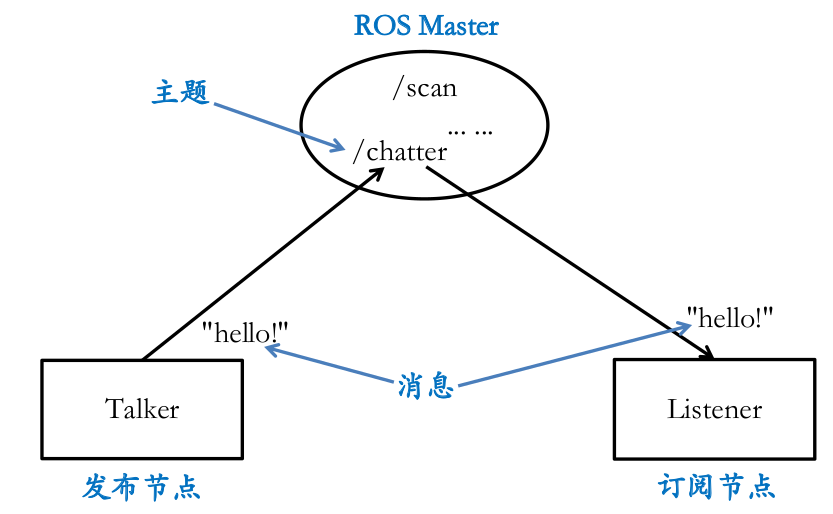
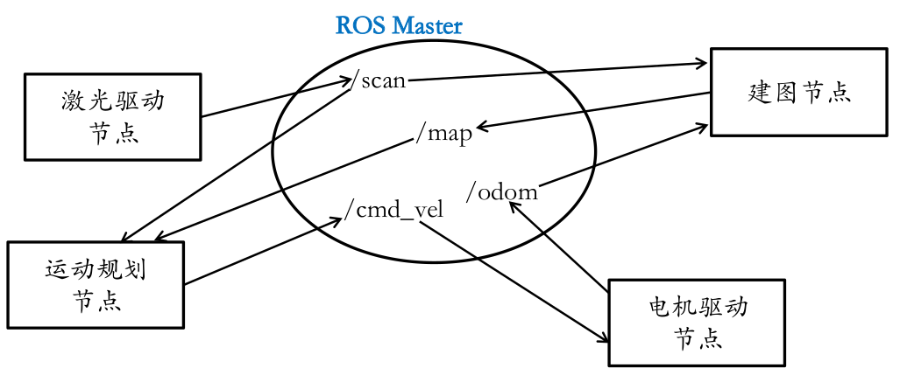

3.ROS介绍和基本概念
===================

3.1 ROS是什么
~~~~~~~~~~~~~~~

    官方定义：ROS(Robot Operating System)是面向机器人的开源的元操作系统(meta-operating system)。它能够提供类似传统操作系统的诸多功能,如硬件抽象、底层设备控制、常用功能实现、进程间消息传递和程序包管理等。此外,它还提供相关工具和库,用于获取、编译、编辑代码以及在多个计算机之间运行程序完成分布式计算。

ROS = 管道+工具+能力+生态

.. figure:: images/ros_equation.png
   :alt: 

3.2 ROS版本介绍
~~~~~~~~~~~~~~~~

+---------+----------+---------+---------+---------+---------+
| ROS版本 | electric | fuerte  | groovy  |  hydro  | indigo  |
+=========+==========+=========+=========+=========+=========+
| Ubuntu  | - 10.04  | - 10.04 | - 11.10 | - 12.04 | - 13.10 |
|         | - 11.10  | - 11.10 | - 12.04 | - 12.10 | - 14.04 |
|         |          | - 12.04 | - 12.10 | - 13.04 |         |
+---------+----------+---------+---------+---------+---------+

+---------+---------+----------+---------+---------+
| ROS版本 |  jade   | kinetic  |  luna   | melodic |
+=========+=========+==========+=========+=========+
| Ubuntu  | - 14.04 | - 15.10  | - 16.04 | - 17.10 |
|         | - 14.10 | - 16.04  | - 16.10 | - 18.04 |
|         | - 15.04 |          | - 17.04 |         |
+---------+---------+----------+---------+---------+

3.3 ROS安装方法
~~~~~~~~~~~~~~~~~

`官方教程 <http://wiki.ros.org/kinetic/Installation/Ubuntu>`__\ 具有十分详细的介绍。

步骤1 添加Ubuntu源地址：
^^^^^^^^^^^^^^^^^^^^^^^^

::

    $ sudo sh -c 'echo "deb http://packages.ros.org/ros/ubuntu $(lsb_release -sc) main" > /etc/apt/sources.list.d/ros-latest.list'

**注意：** 有时使用系统默认源速度会较慢，并且缺少依赖。此时，可将Ubuntu源设置为中科大的，打开/etc/apt/sources.list文件：

::

    $ sudo gedit /etc/apt/sources.list

改为以下内容(以Ubuntu 16.04为例)：

::

    deb http://mirrors.ustc.edu.cn/ubuntu/ xenial main restricted universe multiverse
    deb http://mirrors.ustc.edu.cn/ubuntu/ xenial-security main restricted universe multiverse
    deb http://mirrors.ustc.edu.cn/ubuntu/ xenial-updates main restricted universe multiverse
    deb http://mirrors.ustc.edu.cn/ubuntu/ xenial-proposed main restricted universe multiverse
    deb http://mirrors.ustc.edu.cn/ubuntu/ xenial-backports main restricted universe multiverse
    deb-src http://mirrors.ustc.edu.cn/ubuntu/ xenial main restricted universe multiverse
    deb-src http://mirrors.ustc.edu.cn/ubuntu/ xenial-security main restricted universe multiverse
    deb-src http://mirrors.ustc.edu.cn/ubuntu/ xenial-updates main restricted universe multiverse
    deb-src http://mirrors.ustc.edu.cn/ubuntu/ xenial-proposed main restricted universe multiverse
    deb-src http://mirrors.ustc.edu.cn/ubuntu/ xenial-backports main restricted universe multiverse

步骤2 设置安全公钥：
^^^^^^^^^^^^^^^^^^^^

::

    $ sudo apt-key adv --keyserver hkp://ha.pool.sks-keyservers.net:80 --recv-key 421C365BD9FF1F717815A3895523BAEEB01FA116

步骤3 更新源：
^^^^^^^^^^^^^^

::

    $ sudo apt update

步骤4 安装：
^^^^^^^^^^^^

::

    $ sudo apt install ros-kinetic-desktop-full

或安装其它包： 

::

    $ sudo apt install ros-kinetic-ros-base
    $ sudo apt install ros-kinetic-navigation
    $ sudo apt install ros-kinetic-gmapping

步骤5 安装完后，导出环境变量：
^^^^^^^^^^^^^^^^^^^^^^^^^^^^^^

::

    $ source /opt/ros/kinetic/setup.bash

如果不想每次打开终端都导出环境变量，可将其添加到.bashrc文件中：

::

    $ echo "source /opt/ros/kinetic/setup.bash" >> ~/.bashrc

3.4 ROS通信机制
~~~~~~~~~~~~~~~~

ROS整个通信机制的核心就是：发布订阅机制。例如下图：名为Talker的节点向/chatter主题发送字符串"hello"，另一个名为Listener的节点订阅/chatter主题，接收主题的字符串。

    ``注意：每个主题跟消息类型是绑定的。比如，一个接收string类型消息的主题，是不能接收int数据类型消息的。``

下面是一个更具体的例子，即底盘导航模块所用到的节点及主题。

3.5 ROS包、节点的创建
~~~~~~~~~~~~~~~~~~~~~

ROS中工作区、包、节点的概念类比：

+---------------------+--------------------------+
| ROS                 | Visual Studio            |
+=====================+==========================+
| 工作区(workspace)   | 解决方案(solution)       |
+---------------------+--------------------------+
| 包(package)         | 工程(project)            |
+---------------------+--------------------------+
| 节点(node)          | 可执行文件(executable)   |
+---------------------+--------------------------+

创建工作区
^^^^^^^^^^

工作区即一个目录，用mkdir命令创建即可：

::

    $ cd ~
    $ mkdir catkin_ws

在工作区目录下，创建名为src的文件夹：

::

    $ cd ~/catkin_ws
    $ mkdir src

此时的目录结构：

::

    ~
    |--catkin_ws
        |--src

创建ROS包
^^^^^^^^^

::

    $ cd ~/catkin_ws/src
    $ catkin_create_pkg trd_driver

此时的目录结构：

::

    ~
    |--catkin_ws
        |--src
            |--trd_driver
                |--CMakeLists.txt
                |--package.xml

添加节点(C++源代码)
^^^^^^^^^^^^^^^^^^^

::

    $ cd ~/catkin_ws/src/trd_driver
    $ mkdir src
    $ cd src
    $ gedit hello_world_node.cpp

编辑hello\_world\_node.cpp内容:

.. code:: cpp

    #include "ros/ros.h"
    int main() {
        ROS_INFO("hello world!");
        return 0;
    }

修改~/catkin\_ws/src/trd\_driver/CMakeLists.txt内容：

::

    $ gedit ~/catkin_ws/src/trd_driver/CMakeLists.txt

::

    cmake_minimum_required(VERSION 2.8.3)
    project(trd_driver)

    find_package(catkin REQUIRED
        roscpp
    )
    catkin_package(CATKIN_DEPENDS 
    )

    include_directories(
      include
      ${catkin_INCLUDE_DIRS}
    )

    # hello_world_node
    add_executable(hello_world_node
      src/hello_world_node.cpp
    )
    target_link_libraries(hello_world_node
      ${catkin_LIBRARIES})

此时的目录结构：

::

    ~
    |--catkin_ws
        |--src
            |--trd_driver
                |--CMakeLists.txt
                |--package.xml
                |--src
                    |--hello_world_node.cpp

编译运行节点
^^^^^^^^^^^^

编译：

::

    $ cd ~/catkin_ws
    $ catkin_make

::

    ~
    |--catkin_ws
        |--lib #编译结果目录
        |--devel #编译结果目录
        |--src
            |--trd_driver
                |--CMakeLists.txt
                |--package.xml
                |--src
                    |--hello_world_node.cpp

-  运行(方式一)：

::

    $ cd ~/catkin_ws
    $ ./devel/lib/trd_driver/hello_world_node

-  运行(方式二)：

先将此工作区下的ROS包导出到环境变量，然后用ros run指令启动：

::

    $ cd ~/catkin_ws
    $ source ./devel/setup.bash
    $ rosrun trd_driver hello_world_node

-  运行(方式三)：

建立launch文件，用launch文件启动。

::

    $ cd ~/catkin_ws/src/trd_driver
    $ mkdir launch
    $ cd launch
    $ gedit trd_driver.launch

编辑launch文件内容：

::

    <?xml version="1.0"?>
    <launch>
        <node pkg="trd_driver" type="hello_world_node" name="hello_world_node">
        </node>
    </launch>

启动launch文件（需要保证已经source当前工作区）：

::

    $ roslaunch trd_driver trd_driver.launch

若需要打印节点的log输出，可在启动时加入 **--screen** 参数：

::

    $ roslaunch trd_driver trd_driver.launch --screen

3.6 编写ROS订阅、发布节点(C++)
~~~~~~~~~~~~~~~~~~~~~~~~~~~~~~~~

参照 **hello_world_node** 开发方式，创建一个名为 **talker_node** 的发布者节点
和一个名为 **listener_node** 订阅者节点。分别加入以下源代码并编译运行。

发布者节点
^^^^^^^^^^^

功能：以10Hz的频率，向/chatter主题发布"hello x"(x为计数)字符串。

.. code-block:: cpp
    :caption: trd_driver/src/talker_node.cpp

    #include "ros/ros.h"
    #include "std_msgs/String.h"
    #include <sstream>

    int main(int argc, char *argv[]) {
        ros::init(argc, argv, "talker"); //初始化节点,名称为"talker"
        ros::NodeHandle nh; //创建节点句柄
        ros::Publisher pub = 
             nh.advertise<std_msgs::String>("chatter", 1000); //创建发布者
        ros::Rate loop_rate(10); //设置循环频率
        int count = 0; //循环计数
        while (ros::ok()){
            std_msgs::String msg; //创建消息
            std::stringstream ss;
            ss << "Hello " << count;
            msg.data = ss.str(); //消息赋值
            ROS_INFO("send [%s]", msg.data.c_str());
            
            pub.publish(msg); //发布消息
            ros::spinOnce(); //非阻塞调用
            loop_rate.sleep();
            ++count;
        }
        return 0;
    }

订阅者节点
^^^^^^^^^^^

功能：订阅/chatter主题，并打印收到的内容。

.. code-block:: cpp
    :caption: trd_driver/src/listener_node.cpp

    #include "ros/ros.h"
    #include "std_msgs/String.h"

    void subCallback(const std_msgs::String::ConstPtr& msg) {
        ROS_INFO("I heard: [%s]", msg->data.c_str());
    }

    int main(int argc, char *argv[]) {
        ros::init(argc, argv, "listener"); //初始化节点,名称为"listener"
        ros::NodeHandle nh;//创建节点句柄
        ros::Subscriber sub = 
             nh.subscribe("chatter", 1000, subCallback); //创建订阅者
        ros::spin(); //阻塞调用
        return 0;
    }

CMakeLists.txt
^^^^^^^^^^^^^^^

修改 **trd_driver/CMakeLists.txt** 内容，添加两节点。

.. code-block:: cmake
    :caption: trd_driver/CMakeLists.txt

    cmake_minimum_required(VERSION 2.8.3)
    project(trd_driver)
    
    find_package(catkin REQUIRED
        roscpp
    )
    catkin_package(CATKIN_DEPENDS
    )
    
    include_directories(
      include
      ${catkin_INCLUDE_DIRS}
    )
    
    # hello_world_node
    add_executable(hello_world_node
      src/hello_world_node.cpp
    )
    target_link_libraries(hello_world_node
      ${catkin_LIBRARIES})
    
    # talker_node
    add_executable(talker_node
      src/talker_node.cpp
    )
    target_link_libraries(talker_node
      ${catkin_LIBRARIES})
    
    # listener_node
    add_executable(listener_node
      src/listener_node.cpp
    )
    target_link_libraries(listener_node
      ${catkin_LIBRARIES})

运行发布者和订阅者
^^^^^^^^^^^^^^^^^^^

为了避免每次启动终端，都要导出当前工作区环境变量，
可以将导出命令加入到当前用户的 **~/.bashrc** 文件中：

::
   
    $ echo "source ~/catkin_ws/devel/setup.bash" >> ~/.bashrc

打开新的终端，启动 **roscore** ：

::
    
    $ roscore

打开新的终端，启动 **talker_node** 节点：

::
    
    $ rosrun trd_driver talker_node

打开新的终端，启动 **listener_node** 节点：

::
    
    $ rosrun trd_driver listener_node

此时，可看到订阅者打印接收到的内容。

3.7 编写ROS订阅、发布节点(Python)
~~~~~~~~~~~~~~~~~~~~~~~~~~~~~~~~~~

请参照\ `官方教程 <http://wiki.ros.org/ROS/Tutorials/WritingPublisherSubscriber%28python%29>`__\ 自行尝试。

3.8 ROS学习网站
~~~~~~~~~~~~~~~

-  ROS维基网站： http://wiki.ros.org/
-  ROS官方教程: http://wiki.ros.org/ROS/Tutorials
-  ROS Answers论坛： `answers.ros.org <answers.ros.org>`__
-  创客智造： https://www.ncnynl.com/

3.9 ROS学习书籍
~~~~~~~~~~~~~~~~~

1. A Gentle Introduction to ROS
^^^^^^^^^^^^^^^^^^^^^^^^^^^^^^^

(英文版) 链接: https://pan.baidu.com/s/1WtsiWh7o542KCgSNMR8ugQ 密码:
ci3k

(中文版) 链接: https://pan.baidu.com/s/1skP5o819hZE1OsXypFD\_Gw 密码:
p8f9

2. Learning ROS for Robotics Programming
^^^^^^^^^^^^^^^^^^^^^^^^^^^^^^^^^^^^^^^^

链接: https://pan.baidu.com/s/1sjegN3w\_ehvhxT00d1xBiw 密码: bnce

3. Programming Robots with ROS: A Practical Introduction to the Robot Operating System
^^^^^^^^^^^^^^^^^^^^^^^^^^^^^^^^^^^^^^^^^^^^^^^^^^^^^^^^^^^^^^^^^^^^^^^^^^^^^^^^^^^^^^

链接: https://pan.baidu.com/s/1QkqD-Zu\_i3KJNCn0xSsKng 密码: qd82

4. Robot Operating System (ROS)The Complete Reference
^^^^^^^^^^^^^^^^^^^^^^^^^^^^^^^^^^^^^^^^^^^^^^^^^^^^^

链接: https://pan.baidu.com/s/1d4UZd3Ast9SxPhz8HZh9gg 密码: ep42
