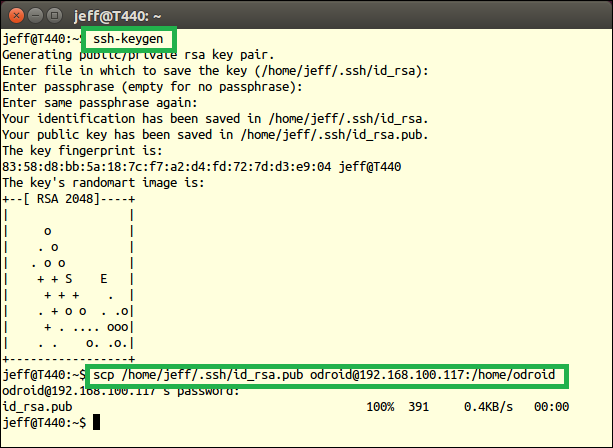

附录:RoboWare Studio安装及使用 
===============================

RoboWare Studio介绍
~~~~~~~~~~~~~~~~~~~~~

RoboWare Studio是一个ROS集成开发环境。它使ROS开发更加直观、简单，并且易于操作。可进行ROS工作区及包的管理，代码编辑、构建及调试。

RoboWare Studio的主要特性有：

**（1）易于安装及配置**

下载后双击即可安装，RoboWare Studio可自动检测并加载ROS环境，无需额外配置。这种“开箱即用”的特性能够帮助开发者迅速上手。

**（2）辅助ROS开发，兼容indigo/jade/kinetic版本**

RoboWare Studio专为ROS (indigo/jade/kinetic)设计，以图形化的方式进行ROS工作区及包的创建、源码添加、message/service/action文件创建、显示包及节点列表。可实现CMakelists.txt文件和package.xml文件的自动更新。

**（3）友好的编码体验**

提供现代IDE的重要特性，包括语法高亮、代码补全、定义跳转、查看定义、错误诊断与显示等。支持集成终端功能，可在IDE界面同时打开多个终端窗口。支持Vim编辑模式。

**（4）C++和Python代码调试**

提供Release、Debug及Isolated编译选项。以界面交互的方式调试C++和Python代码，可设置断点、显示调用堆栈、单步运行，并支持交互式终端。可在用户界面展示ROS包和节点列表。

**（5）远程部署及调试**

可将本地代码部署到远程机器上，远程机器可以是X86架构或ARM架构。可在本地机器实现远程代码的部署、构建和实时调试。

**（6）内置Git功能**

Git使用更加简单。可在编辑器界面进行差异比对、文件暂存、修改提交等操作。可对任意Git服务仓库进行推送、拉取操作。

**（7）遵循ROS规范**

从代码创建、消息定义，到文件存储路径的创建及选择等，RoboWare Studio会引导开发者进行符合ROS规范的操作，协助开发者编写高质量、符合规范的ROS包。

RoboWare Studio软件安装
~~~~~~~~~~~~~~~~~~~~~~~~

准备
^^^^^
安装前，请查看系统环境并确认：

（1）操作系统为Ubuntu。

（2）已完成ROS的安装配置。ROS安装步骤可参照官方网站：http://wiki.ros.org/kinetic/Installation/Ubuntu

（3）可使用catkin_make构建ROS包。（若无法构建，您可能需要运行

::

    $ sudo apt install build-essential

来安装基本构建工具。）

（4）为支持Python相关功能，需要安装pylint。

::

    $ sudo apt install python-pip
    $ sudo python -m pip install pylint

（5）为支持clang-format相关功能，需要安装clang-format-3.8或更高版本。

::

    $ sudo apt install clang-format-3.8

安装
^^^^^

下载RoboWare Studio最新版，在终端执行以下命令进行安装：

::

    $ cd /path/to/deb/file/
    $ sudo dpkg -i roboware-studio_<version>_<architecture>.deb

其中，<version>表示软件版本号，<architecture>表示机器的处理器架构（amd64为64位版本，i386为32位版本）。
将<version>和<architecture>替换为当前文件信息即可（小技巧：可在输入“sudo dpkg -i ”后按Tab键自动补全文件名）。
安装后，RoboWare Studio会自动检测并加载ROS环境，无需额外配置。

升级
^^^^^

下载最新的RoboWare Studio安装包deb文件，参照安装步骤直接安装即可，旧版本会被自动覆盖。

卸载
^^^^^

打开任一终端，执行以下指令卸载RoboWare Studio：

::

    $ sudo apt remove roboware-studio

启动
^^^^^

**方式一（推荐）：** 点击屏幕左上角的Ubuntu图标，打开Dash，搜索“roboware-studio”，单击启动。

**方式二：** 通过终端启动，打开任一终端，执行：

::

    $ roboware-studio

本地模式使用教程
~~~~~~~~~~~~~~~~~~

(1)创建工作区
^^^^^^^^^^^^^^^^^^^

在欢迎界面，点击“新建工作区”按钮（或选择“文件 - 新建工作区”），选择路径并填写工作区名称，如“catkin_ws”，则会创建一个名为“catkin_ws”工作区，并显示在资源管理器窗口。

(2)打开/关闭工作区
^^^^^^^^^^^^^^^^^^^

在欢迎界面，点击“打开工作区”按钮（或选择“文件 - 打开工作区”），选择需要打开的ROS工作区，打开后即可显示在资源管理器窗口。

选择“文件 - 关闭工作区”，RoboWare Studio会关闭当前的工作区并返回欢迎界面。

(3)创建ROS包
^^^^^^^^^^^^^^^^^^^

右键点击ROS工作区下的“src”，选择“新建ROS包”，输入包名称及其依赖包的名称，如：

:: 

    my_package roscpp std_msgs

回车后，会创建名为“my_package”、以“roscpp”和“std_msgs”为依赖的ROS包。

(4)添加新的动态链接库或可执行文件（ROS节点）
^^^^^^^^^^^^^^^^^^^^^^^^^^^^^^^^^^^^^^^^^^^^^^^

右键点击包名文件夹（如“my_package”），选择“新建Src文件夹”，会自动创建ROS标准的src源码目录，其它必要的目录也可通过此右键菜单来创建。

右键点击ROS包目录下的“src”，选择“新建CPP源文件”，输入文件名后，点击回车键，会弹出以下列表：

- 加入到新的库文件中
- 加入到新的可执行文件中

在列表中选择类型，则会创建一个与CPP文件同名的动态链接库或可执行文件（ROS节点），此时CMakeLists.txt文件会自动更新。

同理，右键点击ROS包目录下的“include/包名”，选择“新建头文件”，也可通过同样方式进行添加。

(5)添加C++源代码到动态链接库或可执行文件（ROS节点）
^^^^^^^^^^^^^^^^^^^^^^^^^^^^^^^^^^^^^^^^^^^^^^^^^^^^

右键点击ROS包目录下的“src”，选择“新建CPP源文件”，输入文件名后，点击回车键，会弹出以下列表：

- my_library1
- my_library2
- my_executable1
- 加入到新的库文件中
- 加入到新的可执行文件中

其中my_library1、my_library2、my_executable1为已建立的库和可执行文件（节点），以列表的形式列出。
选择对应的条目（如my_executable1），CPP文件会添加到my_executable1可执行文件中。此时CMakeLists.txt文件会自动更新。

(6)编辑catkin ROS依赖包
^^^^^^^^^^^^^^^^^^^^^^^^

右键点击包名文件夹（如“my_package”），选择“编辑依赖的ROS包列表”，加入新增的依赖包名称，如：

::

    std_msgs

回车后，会自动修改CMakeLists.txt的依赖包列表，如依赖多个ROS包的时候需要用空格把每个依赖包隔开。

(7)添加message/service/action
^^^^^^^^^^^^^^^^^^^^^^^^^^^^^^^

右键点击包名文件夹（如“my_package”），选择“新建Msg文件夹”、“新建Srv文件夹”、
“新建Action文件夹”可分别创建message、service、action文件夹。
右键点击相应文件夹即可添加message、service、action文件。此时CMakeLists.txt文件会自动更新。

(8)构建工作区
^^^^^^^^^^^^^^

RoboWare Studio支持catkin_make构建工具和catkin_tools构建工具。

选择菜单“文件 – 首选项 – 设置”可打开设置界面，点击“ROS - ros.buildTool”标签左侧的编辑标志，即可选择构建工具。

其中，Debug和Release选项分别表示构建调试版和发布版，默认构建方式为本地构建。
catkin make方式下，带有“isolated”的选项表示利用“catkin_make_isolated”命令进行构建。
带有“remote”的选项表示进行远程构建。“Remote Deploy”选项表示部署本地代码到远程计算机。
关于远程开发的具体步骤会在下一节“远程模式使用教程”介绍，在此以本地构建为例进行说明。

完成构建选项选择后，点击配置列表左侧的构建按钮，或选择“ROS”-“构建”即可构建对应版本的ROS包。构建完成后，资源管理器窗口下方的“ROS节点”子窗口会显示当前工作区下所有的ROS包及节点列表。

选择“查看 - 输出”可打开“输出”窗口，显示构建输出结果。若构建过程中出现错误，按住“CTRL”键并点击错误提示，即可跳转到源代码对应位置。

(9)构建工作区下的一个或多个包
^^^^^^^^^^^^^^^^^^^^^^^^^^^^^^

默认情况下，点击“构建”按钮会构建当前工作区下的所有包。如果只想构建其中的一个或多个包，可右键点击包名，将其设置为活动状态。可同时将一个或多个包设置为活动状态。此时，不被编译的包即称为“非活动包”，在目录列表中将会以删除线标记出来。点击“构建”按钮，RoboWare Studio只会对处于活动状态的包进行构建。

(10)清理构建结果
^^^^^^^^^^^^^^^^^^

构建完成后，资源管理器窗口下方的“ROS节点”子窗口会显示当前工作区下所有的ROS包及节点列表。

点击“ROS节点”子窗口上的“清理”按钮，则会对构建结果进行清理。

(11)集成终端使用
^^^^^^^^^^^^^^^^^

选择“查看 - 集成终端”选项，可在编辑窗口下方打开集成终端窗口。集成终端默认打开路径为当前ROS工作区根目录。可在集成终端中执行任意命令行指令。

可以点击集成终端窗口右上方的“+”按钮打开新的集成终端，并在下拉列表中进入对应的集成终端。

(12)添加并启动launch文件
^^^^^^^^^^^^^^^^^^^^^^^^^

首先，右键点击包名文件夹（如“my_package”），选择“新建Launch文件夹”可创建launch文件夹。然后，右键点击launch文件夹，输入文件名添加launch文件。

编辑完后，右键launch文件，选择“运行Launch文件”即可，RoboWare Studio会自动打开集成终端并运行launch文件。

(13)编辑~/.bashrc文件
^^^^^^^^^^^^^^^^^^^^^^^

选择菜单“ROS – 打开~/.bashrc文件”即可打开并编辑.bashrc文件。

远程模式使用教程
~~~~~~~~~~~~~~~~~~

(1)配置SSH公钥无密登录
^^^^^^^^^^^^^^^^^^^^^^^

首先，在本地计算机生成公钥和私钥。打开终端，执行命令：

::

    $ ssh-keygen

一直按回车键选择默认选项，会在~/.ssh目录下生成id_rsa和id_rsa.pub两个文件。然后将id_rsa.pub文件复制到远程计算机：

::

    $ scp ~/.ssh/id_rsa.pub username@ip_address:/home/username

其中username为远程计算机用户名，ip_address为远程计算机的IP地址，示例如下所示。

将公钥文件id_rsa.pub拷贝到远程计算机后，SSH登录到远程计算机：

::

    $ ssh username@ip_address

其中username为远程计算机用户名，ip_address为远程计算机的IP地址。

登录后，将id_rsa.pub的文件内容追加写入到远程计算机的~/.ssh/authorized_keys文件中，并修改authorized_keys文件的权限：

::

    $ cat id_rsa.pub >> ~/.ssh/authorized_keys
    $ chmod 600 ~/.ssh/authorized_keys

配置完成后，再登录远程计算机就无需输入密码。接下来，即可配置RoboWare Studio的远程调试参数进行远程调试。

(2)修改远程计算机/etc/profile
^^^^^^^^^^^^^^^^^^^^^^^^^^^^^^

首先，登录远程计算机：

::

    $ ssh username@ip_address

其中username为远程计算机用户名，ip_address为远程计算机的IP地址。

登录后，切换到root用户权限，将ROS环境变量信息写入到/etc/profile文件中：

::

    $ sudo su
    $ echo "source /opt/ros/kinetic/setup.bash" >> /etc/profile

在此需要注意，示例中的ROS版本为“kinetic”，对于其它版本替换为对应名称即可。

(3)远程参数配置
^^^^^^^^^^^^^^^^

启动RoboWare Studio后，点击“远程参数配置”按钮，依次配置远程计算机IP地址、远程计算机用户名、本地计算机密钥文件、远程计算机部署路径参数。

(4)远程部署
^^^^^^^^^^^^

完成远程参数配置后，再进行远程部署。

首先，在资源管理器视图下，选择“Remote Deploy”远程部署选项，点击列表左侧的按钮进行远程部署。RoboWare Studio会将当前整个工作区的源代码部署到远程计算机的指定路径下（请参照上一节的“远程参数配置”进行远程部署路径的设置）。

在远程部署过程中，左下角状态栏图标会跳动。部署完成后，会在“输出”窗口显示部署成功的信息（Deploy Finished!）。

(5)远程构建
^^^^^^^^^^^

完成远程部署后，即可进行远程构建。远程构建与本地构建一样，可以选择catkin_make和catkin_tools两种构建方式，若选择catkin_tools构建方式，需要在远程机器上安装catkin_tools工具。在此仅以catkin_make构建方式进行说明。

首先，在资源管理器视图下，选择“Debug (remote)”构建选项，点击列表左侧的按钮进行远程构建。RoboWare Studio会将构建指令发送到远程计算机，并在“输出”窗口显示构建信息。

(6)远程清理
^^^^^^^^^^^

远程构建完成后，资源管理器窗口下方的“ROS节点”子窗口会显示远程工作区下所有的ROS包及节点列表。

点击“ROS节点”子窗口上的“清理”按钮，则会对远程构建结果进行清理。

在此需要注意，点击“清理”按钮，左上角的配置构建选项中如果为“remote”选项，则会清除远程构建结果，否则，则清除本地构建结果。

(7)远程部署/构建一个或多个包
^^^^^^^^^^^^^^^^^^^^^^^^^^^^^

默认情况下，部署时会将当前工作区下的所有包部署到远程主机。如果只想部署其中的一个或多个包，可右键点击包名，将其设置为活动状态。可同时将一个或多个包设置为活动状态。此时，进行部署时，RoboWare Studio只会将处于活动状态的包部署到远程主机。

与本地构建方式相同，当设置一个或多个活动包时，点击“构建”按钮，只会对处于活动状态的包进行构建。当清除所有包的活动状态后，则会回到初始状态（即所有包都处于非活动状态）。当所有包都处于非活动状态时，点击“构建”按钮，则会对当前工作区内的所有包进行构建。

(8)远程启动launch文件
^^^^^^^^^^^^^^^^^^^^^^

右键launch文件，选择“在远程主机上运行Launch文件”，RoboWare Studio会在集成终端中启动远程主机的launch文件。在集成终端中使用“Ctrl + c”快捷键可终止运行。

软件首选项配置
~~~~~~~~~~~~~~~

RoboWare Studio软件可方便地进行的首选项配置，以点选的方式实现用户配置、工作区配置以及主题配置等。选择“文件 – 首选项 – 设置”即可打开配置界面。

FAQ
~~~~~~

**(1)如何导入已有的ROS工作区？**

分两种情况：

- 对于普通的ROS工作区，直接在欢迎界面点击“打开工作区”按钮（或在菜单中选择“文件 - 打开工作区”），选择工作区路径打开即可。
- 对于旧版本RoboWare Studio打开过的ROS工作区，需要将工作区根目录下的“.vscode”文件夹删除，再打开工作区即可。

**(2)如何进行软件升级？**

下载最新的RoboWare Studio安装包deb文件，参照安装步骤直接安装即可，旧版本会被自动覆盖。

**(3)如何修改界面语言？**

在菜单栏中，选择“文件-首选项-语言设置”，打开配置文件。

::

    "locale":"zh-CN" 表示设置为中文界面，
    "locale":"en" 表示设置为英文界面，

可用“//”进行注释。修改完成后，重启RoboWare Studio即可生效。

**(4)新建工作区时提示“路径不是ROS工作区”。**

可能原因为ROS环境变量未导出。安装完ROS后，需要在当前用户家目录下的.bashrc文件中添加以下内容：

::

    source /opt/ros/indigo/setup.bash #（indigo版）

或

::

    source /opt/ros/kinetic/setup.bash #（kinetic版）

ROS的安装及配置说明可参照官网教程：

http://wiki.ros.org/indigo/Installation/Ubuntu （indigo版）

http://wiki.ros.org/kinetic/Installation/Ubuntu （kinetic版）

**(5)提示错误“Linter pylint is not installed”。**

需要安装pylint，请参照本手册“软件安装”-“准备”中的步骤。打开命令行终端，执行以下命令：

::

    $ sudo apt install python-pip

在集成终端中安装python插件时会提示输入root密码，请按照提示输入。

**(6)提示系统git版本低的问题。**

需要升级git。打开命令行终端，执行以下命令：

::

    $ sudo apt-add-repository ppa:git-core/ppa
    $ sudo apt update
    $ sudo apt install git

**(7)名为“test”的节点无法生成问题。**

不要将ROS节点名称命名为test，否则会无法生成节点。

**(8)构建过程中卡住问题。**

对于内存太小的机器，如果当前工作区内的ROS包数量太多，在构建整个工作区时，会因内存不足导致构建卡住。此时，可采用单独构建的方式依次对每个包构建。

**(9)新建、删除文件时资源管理器不能自动刷新。**

RoboWare Studio依靠ubuntu的文件系统监视功能实现资源管理器的自动刷新，
但ubuntu的文件监视数量限制可能设置的太小，导致资源管理器没有自动刷新。
为解决这个问题需要设置ubuntu的文件监视数量限制。方法如下：

使用root权限打开文件/etc/sysctl.conf进行编辑。

::

    $ sudo gedit /etc/sysctl.conf

也可用其它文本编辑器。

找到fs.inotify.max_user_watches选项，适当增加等号后面的数值，比如改为100000。重启ubuntu即可。

**(10)编辑器无法输入、选择、复制问题。**

这是因为RoboWare Studio处于Vim编辑模式，切换到普通模式即可，在菜单栏选择“编辑-切换VIM编辑模式”可切换到普通编辑模式。

**(11)编辑时如何进行前进、后退？能否自定义其快捷键？**

默认的前进快捷键为“Ctrl+Shift+-”，后退快捷键为“Ctrl+Alt+-”。
可以进行快捷键自定义，点击菜单栏的“文件 - 首选项 – 键盘快捷方式”，找到“前进”、“后退”选项进行修改即可，也可对其它快捷键进行自定义。

**(12)CMakelists.txt错误无法定位问题。**

先删除工作区根目录.vscode文件夹下的tasks.json文件，然后重新打开工作区。

**(13)Meta Package无法编辑依赖、无法新建节点问题。**

目前尚不支持meta package编辑依赖和新建节点，将meta package下的所有包拷贝到src目录下即可。

