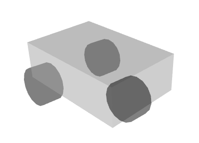
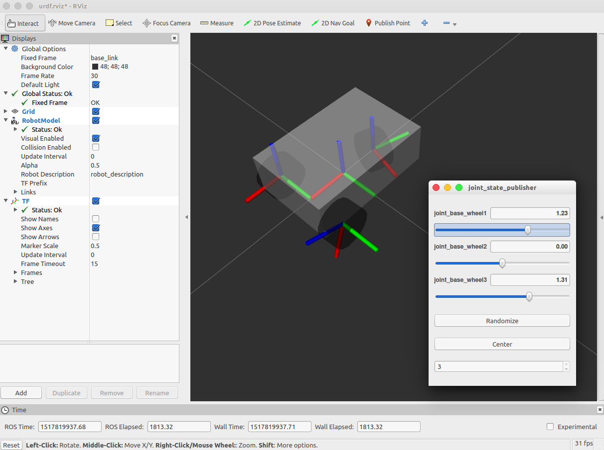
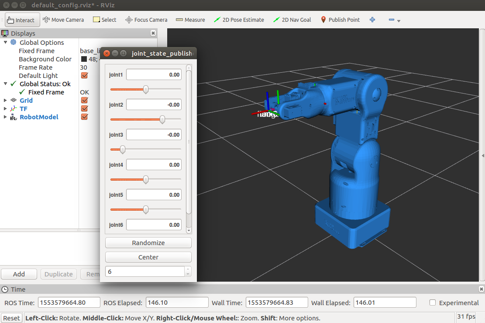

8.Rviz仿真和URDF模型
^^^^^^^^^^^^^^^^^^^^^^^^^^

8.1 ROS的URDF描述格式
~~~~~~~~~~~~~~~~~~~~~~

在 ROS 中,用来描述机器人及其部件的为 URDF 模型,即“统一机器人描述格式
(URDF, Unified Robot Description Format)”。例如,将tr10底盘用下图所示的简易的
机器人底盘模型进行描述,该模型车身用立方体描述,三个轮子用圆柱体描述,这样用4
个基本形状就可以描述一个简易的机器人底盘。

采用 URDF 描述文件对上述简易版的 TR10 机器人模型进行描述,文件内容为：

::

    <robot name="abel05">
      <link name="base_link">
        <visual>
           <geometry>
             <box size="0.2 .3 .1"/>  
           </geometry>  
           <origin rpy="0 0 0" xyz="0 0 0.05"/>  
           <material name="white">  
             <color rgba="1 1 1 1"/>  
           </material>  
        </visual>  
      </link>  
      
      <link name="wheel_1">  
        <visual>  
          <geometry>  
            <cylinder length="0.05" radius="0.05"/>  
          </geometry>  
          <origin rpy="0 1.5 0" xyz="0 0.1 0"/>  
          <material name="black">  
            <color rgba="0 0 0 1"/>  
          </material>  
        </visual>  
      </link>  
      
      <link name="wheel_2">  
        <visual>  
          <geometry>  
            <cylinder length="0.05" radius="0.05"/>  
          </geometry>  
          <origin rpy="0 1.5 0" xyz="-0.1 -0.1 0"/>  
          <material name="black"/>  
        </visual>  
      </link>  
      <link name="wheel_3">  
        <visual>  
          <geometry>  
            <cylinder length="0.05" radius="0.05"/>  
          </geometry>  
          <origin rpy="0 1.5 0" xyz="0.1 -0.1 0"/>  
          <material name="black"/>  
        </visual>
      </link>  
    
      <joint name="joint_base_wheel1" type="fixed">  
        <parent link="base_link"/>  
        <child link="wheel_1"/>  
      </joint>  
      
      <joint name="joint_base_wheel2" type="fixed">  
        <parent link="base_link"/>  
        <child link="wheel_2"/>  
      </joint>  
      
      <joint name="joint_base_wheel3" type="fixed">  
        <parent link="base_link"/>  
        <child link="wheel_3"/>  
      </joint>  
    </robot> 

其中，link表示一个形状(如圆柱、立方体或其它不规则几何体)。
joint为连接link之间的关节，并指定了旋转轴。

由于 ROS 开发时都需要在工作区下进行,所以先建立一个 ROS 工作区,之后所有
的文件都在此工作区下进行。打开终端,创建 ROS 工作区和包:

::

    $ cd
    $ mkdir -p sim_ws/src
    $ cd sim_ws/src
    $ catkin create pkg tr10_description
    $ cd tr10_description
    $ mkdir urdf
    $ cd urdf

然后在 urdf 文件夹下新建 tr10.urdf 文件,内容如上述源代码的内容,描述了一个
简易版的 tr10 机器人底盘模型。

::

    sim_ws                      #工作区目录
     |--src                     #源代码目录
        |--tr10_description     #tr10_description 包目录
            |--CMakeLists.txt
            |--package.xml
            |--urdf             #urdf 描述文件目录
                |--tr10.urdf

依次执行以下指令,编译工作区,并将工作区导出到环境变量:

::

    $ cd ~/sim_ws
    $ catkin_make
    $ echo "source ~/sim_ws/devel/setup.bash" >> ~/.bashrc
    $ source ~/.bashrc

此时,可利用 roslaunch 工具启动 RViz 工具,预览上述 URDF 模型:

::

    $ roslaunch urdf_tutorial display.launch model:=`rospack find tr10_description`/urdf/tr10.urdf

调节关节位置，观察模型变化。

**动手操作**：修改URDF模型内容，并RViz可视化工具观察模型变化。

8.2 Gauss机械臂URDF
~~~~~~~~~~~~~~~~~~~~~~

Gauss机械臂的URDF描述文件在gauss_description包中。
描述文件为urdf包下的gauss.urdf.xacro。

gauss_description包在gauss源代码仓库下，gauss托管下载地址为https://github.com/tonyrobotics/gauss。
下载后，将其中的gauss_description包拷贝到本地的~/sim_ws/src/源码文件夹下。

其中xacro文件与urdf文件类似，实质上是一样的。
xacro提供了一种更丰富的描述方式，比如可以定义宏，进行模块化便于重用。

可以看到，其中描述各个部件形状的<geometry>标签不再是圆柱、立方体等标准模型了，
而是描述机械臂每个模块的描述文件，通常用.stl文件或.dae文件描述，此处为.stl文件。

进入urdf文件，运行RViz可视化工具进行查看。

::

    $ roslaunch urdf_tutorial display.launch model:=gauss.urdf.xacro

